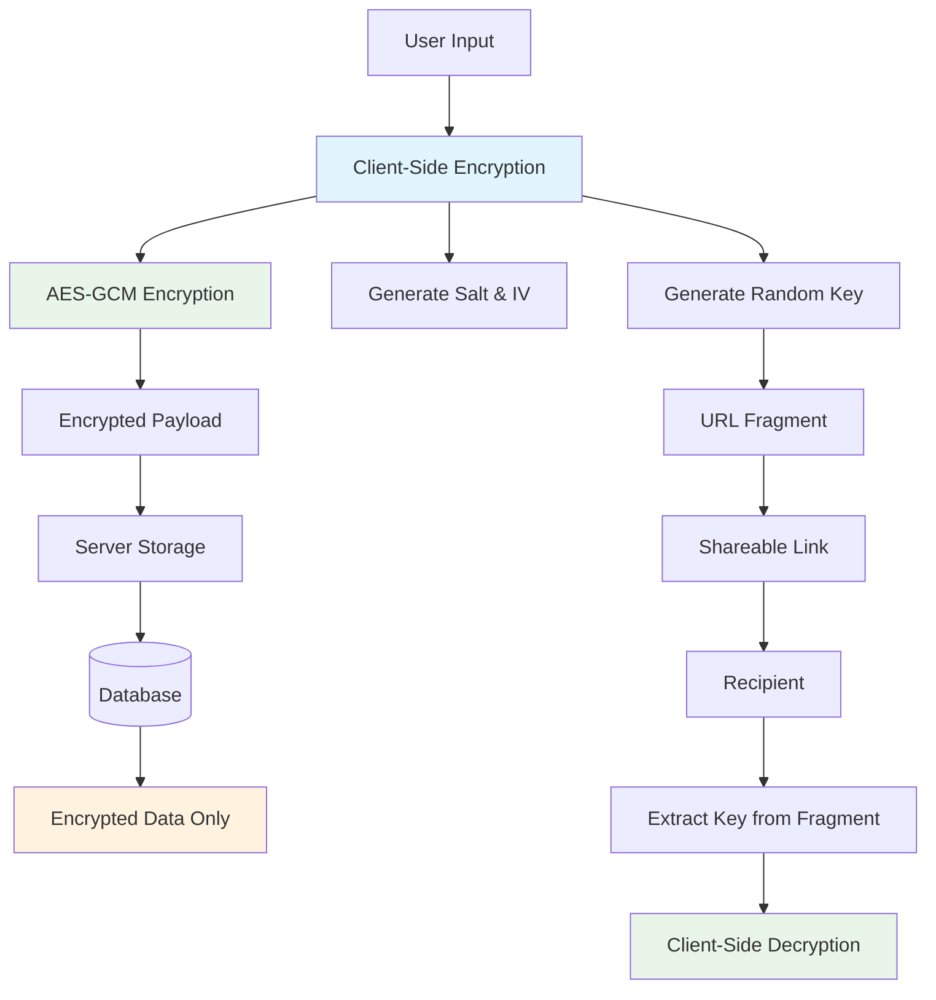
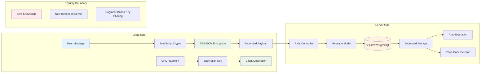

# [Celox.ME](https://celox.me) 🔐

Celox.**ME**ssage is a secure, self-destructing message application built with Ruby on Rails 8. It features client-side encryption and automatic message expiration for maximum privacy.

## 🌟 Features

- **Client-Side Encryption**: Messages are encrypted in your browser before being sent, using AES-256-GCM encryption.
- **Self-Destructing Messages**: Messages are automatically deleted after being read once or when they expire.
- **Flexible Expiration**: Choose from 5 minutes, 1 hour, 6 hours, or 1 day.
- **Zero-Knowledge Architecture**: The server never sees plaintext content.
- **Secure Key Management**: Encryption keys are generated client-side and transmitted only via URL fragments.
- **Responsive Design**: Built with Tailwind CSS and DaisyUI for a seamless experience on any device.

## 📋 Table of Contents

- [Features](#-features)
- [Architecture](#-architecture)
- [Security Model](#-security-model)
- [Installation](#-installation)
- [Usage](#-usage)
- [API Reference](#-api-reference)
- [Workflow Diagrams](#-workflow-diagrams)
- [Technology Stack](#-technology-stack)
- [Contributing](#-contributing)
- [License](#-license)

## 🏗️ Architecture

Celox uses a zero-knowledge architecture with bot protection, ensuring the server never has access to plaintext message content:

**Privacy-preserving human verification** protects messages from bots and link previewers that would trigger permanent deletion when shared on messaging platforms.

1. **Client-Side Encryption**: All encryption and decryption happen in the browser.
2. **Fragment-Based Key Sharing**: Encryption keys are shared via URL fragments and never sent to the server.
3. **Human Verification**: Simple math captcha prevents automated access without third-party dependencies.
4. **Single-Read Destruction**: Messages are automatically deleted after their first successful access.
5. **Time-Based Expiration**: Expired messages are cleaned up automatically.

## 🔒 Security Model

### Encryption Details

- **Algorithm**: AES-256-GCM (Galois/Counter Mode)
- **Key Derivation**: PBKDF2 with 1,000 iterations
- **Salt**: 16 random bytes per message
- **IV**: 12 random bytes per message
- **Key Length**: 256 bits

### Security Features

- **Zero-Knowledge**: The server never sees plaintext or encryption keys.
- **Forward Secrecy**: Each message uses unique encryption parameters.
- **Automatic Purging**: Messages are deleted from the database after being read.
- **Secure Random Generation**: Cryptographically secure random number generation (WebCrypto API).
- **Fragment-Based Key Sharing**: Encryption keys never leave the client.

## 🚀 Installation

### Prerequisites

- Ruby 3.4+
- Rails 8.0+
- Node.js 18+
- SQLite3 (development) or PostgreSQL (production)

### Setup

1. **Clone the repository**
   ```bash
   git clone https://github.com/your-username/celox.git
   cd celox
   ```

2. **Install dependencies**
   ```bash
   bundle install
   npm install
   ```

3. **Set up the database**
   ```bash
   rails db:create
   rails db:migrate
   rails db:seed
   ```

4. **Start the development server**
   ```bash
   bin/dev
   ```

5. **Open the application**
   ```
   http://localhost:3000
   ```

## 🎯 Usage

### Creating a Secure Message

1. Go to the home page.
2. Enter your confidential message (up to 5,000 characters).
3. Select an expiration time (from 5 minutes to 1 day).
4. Click "Encrypt & Create Link."
5. Share the generated secure link with your recipient.

### Reading a Secure Message

1. Click the secure link provided by the sender.
2. The message will automatically decrypt if the key is present in the URL.
3. The message is immediately deleted from the server after viewing.
4. One-time access only—subsequent visits will display an "already read" message.

## 📡 API Reference

### Create Message

```http
POST /m
Content-Type: application/json

{
  "message": {
    "body": "Your confidential message",
    "expiration_duration": "one_hour"
  }
}
```

**Response:**
```json
{
  "success": true,
  "message": {
    "stub": "abc123xyz",
    "retrieval_url": "https://app.com/m/abc123xyz"
  }
}
```

### Retrieve Message

```http
GET /m/:stub
```

**Response:**
- If unread: Returns the captcha challenge form for human verification.
- If already read: Returns an "already read" notification.
- If expired or not found: Returns a 404 error.

### Fetch Message (After Captcha)

```http
GET /m/:stub/fetch
Headers:
  X-Challenge-Answer: 42
```

**Response (Success):**
```json
{
  "success": true,
  "body": "encrypted_message_data",
  "read_at": "2024-01-01T12:00:00Z"
}
```

**Response (Challenge Failed):**
```json
{
  "success": false,
  "error": "Invalid challenge. Please refresh and try again."
}
```

### Expiration Options

- `five_minutes`: 5 minutes
- `one_hour`: 1 hour (default)
- `six_hours`: 6 hours
- `one_day`: 1 day

## 📊 Workflow Diagrams

### Message Creation Flow


### Message Retrieval Flow


### Security Architecture



### Data Flow Architecture



### Message Lifecycle


## 🛠️ Technology Stack

### Backend
- **Ruby on Rails 8.0** – Web application framework
- **SQLite3** – Development database
- **PostgreSQL** – Production database (recommended)
- **Solid Queue** – Background job processing
- **Solid Cache** – Database-backed caching

### Frontend
- **Hotwire (Turbo + Stimulus)** – Modern SPA-like interactions
- **Tailwind CSS 4** – Utility-first CSS framework
- **DaisyUI 5** – UI component library
- **Web Crypto API** – Browser-native cryptography

### JavaScript Architecture
- **Stimulus Controllers** – Organized, reusable JavaScript components
- **Import Maps** – Native ES modules without bundling
- **Web Crypto API** – Secure client-side encryption

### Development Tools
- **ESLint** – JavaScript linting
- **Prettier** – Code formatting
- **RSpec** – Testing framework
- **FactoryBot** – Test data generation
- **Brakeman** – Security vulnerability scanning

## 🧪 Testing

Run the test suite:

```bash
# Run all tests
bundle exec rspec

# Run specific test files
bundle exec rspec spec/models/message_spec.rb
bundle exec rspec spec/controllers/messages_controller_spec.rb

# Run with coverage
COVERAGE=true bundle exec rspec
```

## 🔧 Configuration

### Environment Variables

```bash
# Production settings
RAILS_ENV=production
SECRET_KEY_BASE=your_secret_key
```

### Deployment

The application is ready for deployment with:

- **Kamal** – Modern deployment tool
- **Docker** – Containerization

## 🤝 Contributing

1. Fork the repository.
2. Create a feature branch (`git checkout -b feature/amazing-feature`).
3. Commit your changes (`git commit -m 'feat: add amazing feature'`).
4. Push to your branch (`git push origin feature/amazing-feature`).
5. Open a Pull Request.

### Commit Convention

This project uses [Conventional Commits](https://www.conventionalcommits.org/):

- `feat:` – New features
- `fix:` – Bug fixes
- `docs:` – Documentation changes
- `style:` – Code style changes
- `refactor:` – Code refactoring
- `test:` – Test additions or changes
- `chore:` – Maintenance tasks

## 📄 License

This project is licensed under the MIT License. See the [LICENSE](LICENSE) file for details.

## 🛡️ Security

### Reporting Security Issues

If you discover a security vulnerability, please email security@celox.me instead of creating a public issue.

### Security Best Practices

- Messages are encrypted client-side before transmission.
- Encryption keys never leave the client browser.
- All inputs are validated and sanitized server-side.
- Messages are automatically deleted after being read.
- Unread messages expire after a set time.
- CSRF protection is enabled.
- Secure headers are configured.

## 🙏 Acknowledgments

- Built with [Ruby on Rails](https://rubyonrails.org/)
- UI powered by [Tailwind CSS](https://tailwindcss.com/) and [DaisyUI](https://daisyui.com/)
- Cryptography via [Web Crypto API](https://developer.mozilla.org/en-US/docs/Web/API/Web_Crypto_API)
- Icons from [Heroicons](https://heroicons.com/)

---

Copyright © 2011-2025 Johanns Gregorian. All rights reserved.
