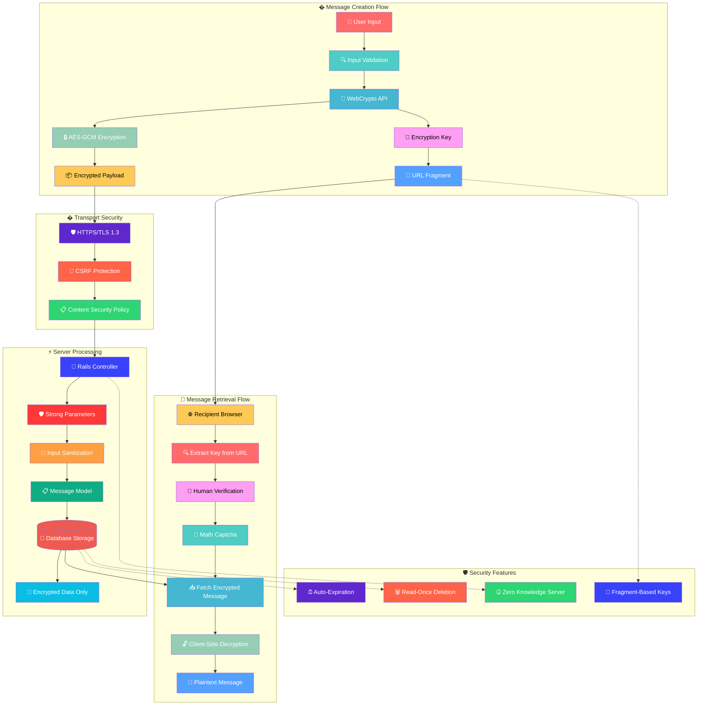
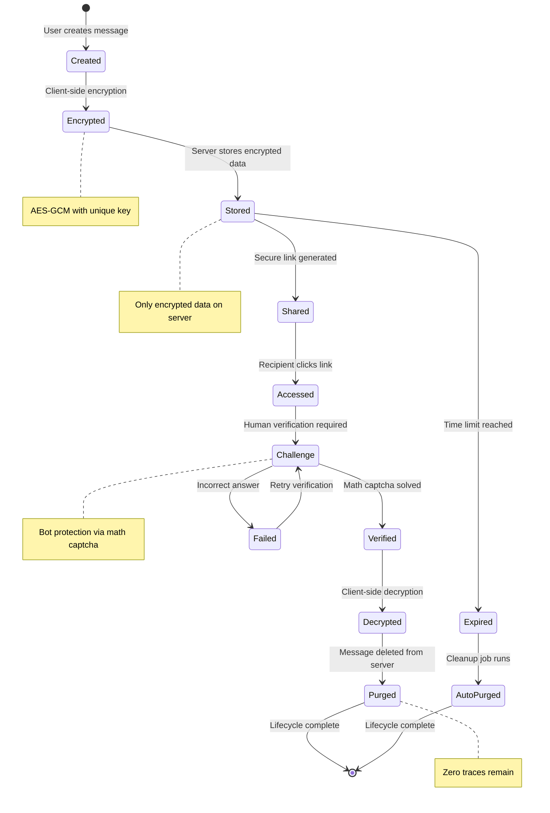

### Security & Data Flow Architecture

```mermaid
graph TB
    subgraph "� Message Creation Flow"
        A[👤 User Input] --> B[🔍 Input Validation]
        B --> C[🔧 WebCrypto API]
        C --> D[🔒 AES-GCM Encryption]
        D --> E[📦 Encrypted Payload]
        C --> F[🔑 Encryption Key]
        F --> G[🔗 URL Fragment]
    end

    subgraph "� Transport Security"
        E --> H[🛡️ HTTPS/TLS 1.3]
        H --> I[🔐 CSRF Protection]
        I --> J[📋 Content Security Policy]
    end

    subgraph "⚡ Server Processing"
        J --> K[🚀 Rails Controller]
        K --> L[🛡️ Strong Parameters]
        L --> M[🧹 Input Sanitization]
        M --> N[📋 Message Model]
        N --> O[(💾 Database Storage)]
        O --> P[🔐 Encrypted Data Only]
    end

    subgraph "📨 Message Retrieval Flow"
        G --> Q[🌐 Recipient Browser]
        Q --> R[🔍 Extract Key from URL]
        R --> S[🧠 Human Verification]
        S --> T[🔢 Math Captcha]
        T --> U[📥 Fetch Encrypted Message]
        O --> U
        U --> V[🔓 Client-Side Decryption]
        V --> W[📄 Plaintext Message]
    end

    subgraph "🛡️ Security Features"
        X[⏰ Auto-Expiration]
        Y[🗑️ Read-Once Deletion]
        Z[🤐 Zero Knowledge Server]
        AA[🔗 Fragment-Based Keys]
    end

    O -.-> X
    O -.-> Y
    K -.-> Z
    G -.-> AA

    style A fill:#ff6b6b,color:#fff
    style B fill:#4ecdc4,color:#fff
    style C fill:#45b7d1,color:#fff
    style D fill:#96ceb4,color:#fff
    style E fill:#feca57,color:#000
    style F fill:#ff9ff3,color:#000
    style G fill:#54a0ff,color:#fff
    style H fill:#5f27cd,color:#fff
    style I fill:#ff6348,color:#fff
    style J fill:#2ed573,color:#fff
    style K fill:#3742fa,color:#fff
    style L fill:#ff3838,color:#fff
    style M fill:#ff9f43,color:#fff
    style N fill:#10ac84,color:#fff
    style O fill:#ee5a52,color:#fff
    style P fill:#0abde3,color:#fff
    style Q fill:#feca57,color:#000
    style R fill:#ff6b6b,color:#fff
    style S fill:#ff9ff3,color:#000
    style T fill:#4ecdc4,color:#fff
    style U fill:#45b7d1,color:#fff
    style V fill:#96ceb4,color:#fff
    style W fill:#54a0ff,color:#fff
    style X fill:#5f27cd,color:#fff
    style Y fill:#ff6348,color:#fff
    style Z fill:#2ed573,color:#fff
    style AA fill:#3742fa,color:#fff
```

### Message Lifecycle

```mermaid
stateDiagram-v2
    [*] --> Created: User creates message
    Created --> Encrypted: Client-side encryption
    Encrypted --> Stored: Server stores encrypted data
    Stored --> Shared: Secure link generated
    Shared --> Accessed: Recipient clicks link
    Accessed --> Challenge: Human verification required
    Challenge --> Verified: Math captcha solved
    Verified --> Decrypted: Client-side decryption
    Decrypted --> Purged: Message deleted from server
    Purged --> [*]: Lifecycle complete

    Challenge --> Failed: Incorrect answer
    Failed --> Challenge: Retry verification

    Stored --> Expired: Time limit reached
    Expired --> AutoPurged: Cleanup job runs
    AutoPurged --> [*]: Lifecycle complete

    note right of Encrypted: AES-GCM with unique key
    note right of Stored: Only encrypted data on server
    note right of Challenge: Bot protection via math captcha
    note right of Purged: Zero traces remain
```
